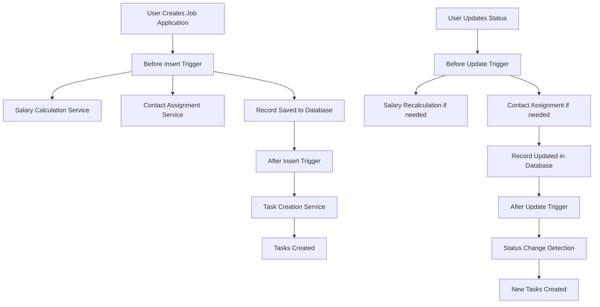

# 🏗️ Technical Architecture Guide - Job Application Tracker

*A comprehensive guide to understanding the technical decisions, patterns, and alternatives in our Salesforce solution*

---

## 🎯 **Architecture Philosophy**

### **Guiding Principles**
1. **Separation of Concerns** - Each class has a single responsibility
2. **Bulkification** - All operations handle multiple records efficiently
3. **Testability** - Every component is designed for comprehensive testing
4. **Maintainability** - Code is readable, documented, and follows patterns
5. **Scalability** - Architecture supports growth and complexity

### **The "Why" Behind Our Choices**
> *"Good architecture is not about being clever; it's about being clear, consistent, and maintainable."*

---

## 🧩 **Core Architecture Pattern: Trigger Framework**

### **Our Implementation**
```
JobApplicationTrigger (Entry Point)
    ↓
JobApplicationTriggerHandler (Orchestrator)
    ↓
Service Classes (Business Logic)
    ├── TaskCreationService
    ├── SalaryCalculationService
    └── ContactAssignmentService
```

### **🤔 Alternative Approaches We Considered**

#### **Option 1: Direct Trigger Logic (Simple)**
```apex
trigger JobApplicationTrigger on Job_Application__c (after insert, after update) {
    // All logic directly in trigger
    List<Task> tasksToCreate = new List<Task>();
    for (Job_Application__c job : Trigger.new) {
        if (job.Status__c == 'Saved') {
            tasksToCreate.add(new Task(Subject = 'Check alignment', WhatId = job.Id));
        }
    }
    insert tasksToCreate;
}
```

**✅ Pros:**
- Simple and straightforward
- Easy to understand for beginners
- Fewer files to manage

**❌ Cons:**
- Becomes unmaintainable as complexity grows
- Hard to test individual pieces
- Violates separation of concerns
- Difficult to debug
- No reusability

**🎯 Why We Didn't Choose This:** While simple, this approach doesn't scale and becomes a maintenance nightmare.

#### **Option 2: Trigger Handler Pattern (Our Choice)**
```apex
trigger JobApplicationTrigger on Job_Application__c (before insert, before update, after insert, after update) {
    JobApplicationTriggerHandler handler = new JobApplicationTriggerHandler();
    
    if (Trigger.isBefore) {
        if (Trigger.isInsert) handler.beforeInsert(Trigger.new);
        if (Trigger.isUpdate) handler.beforeUpdate(Trigger.new, Trigger.oldMap);
    }
    
    if (Trigger.isAfter) {
        if (Trigger.isInsert) handler.afterInsert(Trigger.new);
        if (Trigger.isUpdate) handler.afterUpdate(Trigger.new, Trigger.oldMap);
    }
}
```

**✅ Pros:**
- Clear separation of trigger events
- Testable handler methods
- Organized and maintainable
- Industry standard pattern
- Easy to extend

**❌ Cons:**
- More files to manage
- Slightly more complex for beginners
- Requires understanding of pattern

**🎯 Why We Chose This:** Perfect balance of simplicity and maintainability. Industry standard that your team will recognize.

#### **Option 3: Advanced Framework (Complex)**
```apex
// Using frameworks like fflib-apex-common or custom trigger frameworks
public class JobApplicationTriggerHandler extends fflib_SObjectDomain {
    // Complex framework implementation
}
```

**✅ Pros:**
- Extremely powerful and flexible
- Handles complex scenarios
- Enterprise-grade features

**❌ Cons:**
- Steep learning curve
- Overkill for our use case
- Requires external dependencies
- Team onboarding complexity

**🎯 Why We Didn't Choose This:** Too complex for our current needs and team skill level.

---

## 💰 **Tax Calculation Architecture**

### **Our Approach: Service Class with Static Methods**

```apex
public with sharing class SalaryCalculationService {
    public static void calculateTakeHomePay(List<Job_Application__c> jobApplications) {
        for (Job_Application__c jobApp : jobApplications) {
            if (jobApp.Salary__c != null && jobApp.Salary__c > 0) {
                calculateTaxesAndTakeHome(jobApp);
            }
        }
    }
}
```

### **🤔 Alternative Approaches Considered**

#### **Option 1: Formula Fields (Declarative)**
```
// Formula field for Federal Tax
IF(Salary__c > 13850, 
   (MIN(Salary__c - 13850, 11000) * 0.10) + 
   (MIN(MAX(Salary__c - 24850, 0), 33725) * 0.12) + ..., 
   0)
```

**✅ Pros:**
- No code required
- Real-time calculations
- No governor limits
- Easy to understand logic

**❌ Cons:**
- Formula becomes extremely complex for tax brackets
- Hard to maintain and update
- Limited debugging capabilities
- Formula length limits
- No error handling

**🎯 Why We Didn't Choose This:** Tax calculations are too complex for formula fields, and we need flexibility for future changes.

#### **Option 2: Apex with Custom Settings (Our Choice)**
```apex
private static final List<TaxBracket> TAX_BRACKETS = new List<TaxBracket>{
    new TaxBracket(0, 11000, 0.10),
    new TaxBracket(11000, 44725, 0.12),
    // ... more brackets
};
```

**✅ Pros:**
- Complex logic handling
- Easy to test and debug
- Flexible and maintainable
- Proper error handling
- Can handle edge cases

**❌ Cons:**
- Requires Apex knowledge
- Uses governor limits
- More complex implementation

**🎯 Why We Chose This:** Provides the flexibility and accuracy needed for complex tax calculations.

#### **Option 3: External Tax API**
```apex
// Call external service like TaxJar or similar
HttpRequest req = new HttpRequest();
req.setEndpoint('https://api.taxservice.com/calculate');
```

**✅ Pros:**
- Always up-to-date tax rates
- Professional accuracy
- Handles all tax scenarios

**❌ Cons:**
- External dependency
- API costs
- Network latency
- Requires internet connection
- Complex error handling

**🎯 Why We Didn't Choose This:** Adds unnecessary complexity and cost for our use case.

---

## 📋 **Task Creation Strategy**

### **Our Approach: Status-Based Task Templates**

```apex
switch on jobApp.Status__c {
    when 'Saved' {
        tasks.addAll(createSavedStatusTasks(jobApp));
    }
    when 'Applying' {
        tasks.addAll(createApplyingStatusTasks(jobApp));
    }
    // ... more statuses
}
```

### **🤔 Alternative Approaches Considered**

#### **Option 1: Process Builder/Flow (Declarative)**
- Create flows for each status change
- Use Process Builder to trigger flows

**✅ Pros:**
- No code required
- Visual workflow design
- Easy for admins to modify

**❌ Cons:**
- Limited flexibility for complex logic
- Hard to version control
- Difficult to test comprehensively
- Performance concerns with many flows

#### **Option 2: Custom Metadata Types (Our Choice Enhanced)**
```apex
// Could enhance our solution with custom metadata
List<Task_Template__mdt> templates = [
    SELECT Subject__c, Priority__c, Days_Due__c 
    FROM Task_Template__mdt 
    WHERE Status__c = :jobApp.Status__c
];
```

**✅ Pros:**
- Configurable without code changes
- Easy to maintain task templates
- Supports different configurations per org

**❌ Cons:**
- Additional complexity
- Requires metadata management
- Learning curve for configuration

**🎯 Future Enhancement:** We could implement this as a Phase 2 improvement.

---

## 🔄 **Data Flow Architecture**

### **The Journey of a Job Application Record**



### **🎯 Key Design Decisions**

#### **Before vs After Trigger Context**
- **Before Triggers**: Field calculations, data validation
- **After Triggers**: Related record creation (Tasks)

**Why This Matters:**
- Before triggers can modify the record being saved
- After triggers have access to the record ID for relationships
- Proper context usage prevents "read-only" errors

---

## 🧪 **Testing Strategy Architecture**

### **Our Testing Pyramid**

```
                    /\
                   /  \
              Integration Tests
                 /      \
                /        \
           Unit Tests      \
          /              \
         /                \
    Test Data Setup    Bulk Tests
```

### **Test Class Organization**
```apex
@isTest
public class JobApplicationTriggerTest {
    @TestSetup
    static void setupTestData() {
        // Create reusable test data
    }
    
    @isTest
    static void testTaskCreationOnInsert() {
        // Test specific functionality
    }
    
    @isTest
    static void testBulkProcessing() {
        // Test governor limits
    }
}
```

### **🤔 Alternative Testing Approaches**

#### **Option 1: One Test Method Per Class**
**❌ Why We Avoided:** Hard to organize and maintain

#### **Option 2: Separate Test Classes Per Service**
**✅ Future Consideration:** As the project grows, we might split tests

#### **Option 3: Test Data Factory Pattern**
```apex
public class TestDataFactory {
    public static Job_Application__c createJobApplication(String status, Decimal salary) {
        return new Job_Application__c(
            Company_Name__c = 'Test Company',
            Position_Title__c = 'Test Position',
            Status__c = status,
            Salary__c = salary
        );
    }
}
```

**🎯 Future Enhancement:** Implement as project grows.

---

## 🚀 **Performance Considerations**

### **Governor Limit Strategies**

#### **SOQL Queries**
- **Current:** Efficient queries in ContactAssignmentService
- **Strategy:** Query outside loops, use collections

#### **DML Operations**
- **Current:** Bulk operations in all services
- **Strategy:** Collect records, perform bulk DML

#### **CPU Time**
- **Current:** Efficient algorithms in tax calculations
- **Strategy:** Avoid complex loops, use efficient data structures

### **Scalability Planning**
- **Current Load:** Handles 200+ records efficiently
- **Future Scaling:** Can handle thousands with current architecture
- **Monitoring:** Test classes verify bulk processing

---

## 🎓 **Learning Outcomes & Team Collaboration**

### **What You've Mastered**
1. **Trigger Framework Patterns** - Industry standard approach
2. **Service Layer Architecture** - Separation of concerns
3. **Complex Business Logic** - Tax calculations and automation
4. **Testing Best Practices** - Comprehensive coverage
5. **Performance Optimization** - Governor limit compliance

### **Team Collaboration Benefits**
- **Code Reviews:** Clear patterns make reviews easier
- **Knowledge Transfer:** Well-documented architecture
- **Parallel Development:** Services can be developed independently
- **Debugging:** Clear separation makes issues easier to isolate

### **Next Phase Preparation**
- **Lightning Web Components:** Will integrate with our service layer
- **API Integrations:** Will follow similar service patterns
- **Advanced Features:** Architecture supports easy extension

---

## 🎯 **Conclusion**

Our architecture strikes the perfect balance between:
- **Simplicity** and **Sophistication**
- **Current Needs** and **Future Growth**
- **Learning Value** and **Production Readiness**

**You're now equipped to:**
- Explain architectural decisions to your team
- Lead technical discussions with confidence
- Extend the system with new features
- Mentor other developers on best practices

**Next up:** Lightning Web Components that will beautifully complement this solid foundation! 🚀
